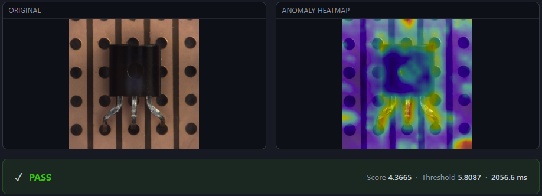
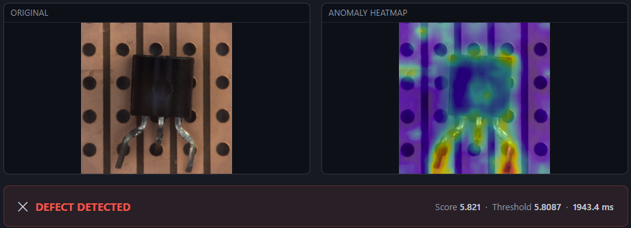
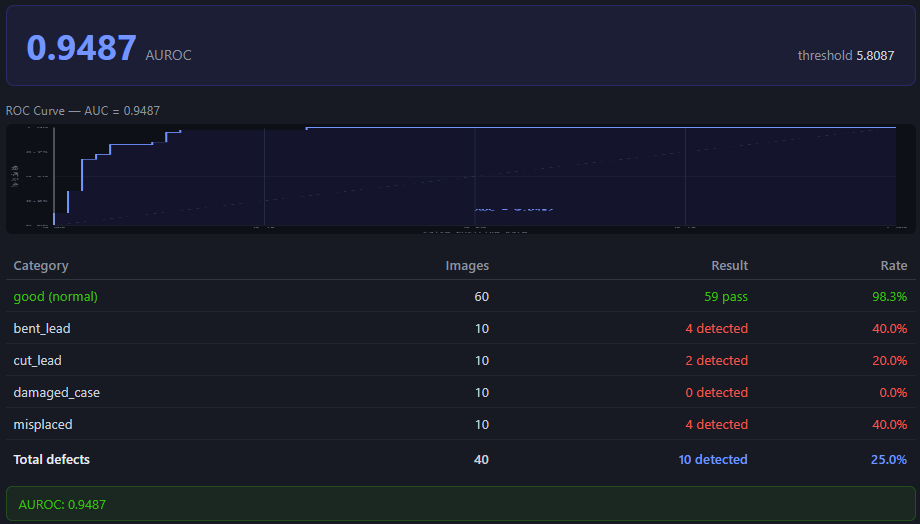
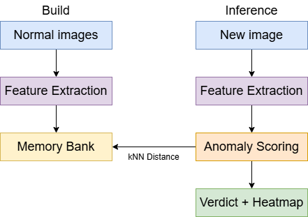
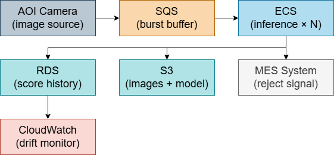

# AOI Defect Detection

Unsupervised IC component defect detection — **no defect labels required**.

Built on [PatchCore (CVPR 2022)](https://openaccess.thecvf.com/content/CVPR2022/html/Roth_Towards_Total_Recall_in_Industrial_Anomaly_Detection_CVPR_2022_paper.html) with WideResNet50-2 backbone, evaluated on the MVTec AD benchmark.

---

## Demo

| Normal component | Defective component |
|---|---|
|  |  |

**Benchmark — AUROC 0.9487 with ROC curve**



---

## Results

| Metric | Value |
|---|---|
| **AUROC** | **0.9487** |
| Normal pass-through rate | 98.3% |

**Backbone ablation** — transistor defects are geometric (bent leads, misplacement), requiring wider feature representations:

| Backbone | AUROC |
|---|---|
| ResNet18 | 0.8750 |
| **WideResNet50-2** | **0.9487** |

Dataset: MVTec AD — transistor (213 training images, 100 test images)

---

## How It Works



- **No GPU training** — uses pretrained ImageNet features
- **Calibration separated from build** — threshold set on held-out normal images
- **Heatmap output** — patch-level anomaly localization upsampled to original resolution

---

## Production Architecture

*Cloud services: AWS*



- **SQS** — decouples camera trigger from inference; handles burst traffic from multiple stations
- **ECS** — containerized inference workers scale horizontally without managing EC2 instances
- **S3** — stores defect images and memory bank `.pkl`; workers pull latest model on startup
- **RDS** — persists per-image pass/fail results and anomaly scores for traceability
- **CloudWatch** — monitors defect rate trend and anomaly score distribution drift

---

## Quick Start

```bash
git clone https://github.com/ordinary9843/aoi-defect-detection.git
cd aoi-defect-detection
docker-compose up --build
```

Open `http://localhost:8000`

Download `transistor.tar.xz` from [MVTec AD](https://www.mvtec.com/company/research/datasets/mvtec-ad) → extract to `data/transistor/`

| Step | Input path |
|---|---|
| 1 — Build | `data/transistor/train/good` |
| 2 — Calibrate | `data/transistor/test/good` |
| 3 — Detect | any image |
| 4 — Benchmark | `data/transistor` |

---

## Performance

| Environment | Latency |
|---|---|
| CPU — Docker (this demo) | ~2000 ms |
| GPU — RTX 3060 (estimated) | ~200–400 ms |
| Production GPU server | < 50 ms |

*Demo: i5-14400F, 16 GB RAM, CPU inference (no GPU passthrough)*

---

## Limitations

| Issue | Cause | Fix |
|---|---|---|
| `damaged_case` not detected | Subtle defect; patch features insufficient | Higher resolution / pixel-level segmentation |
| Memory bank grows with data | Full patch storage, O(N × 784 × 1536) | Coreset subsampling (PatchCore §3.3) |
| Single global threshold | One 99th-percentile value | Per-category calibration |
| CPU inference too slow for production | No GPU passthrough in Docker | CUDA container + GPU server deployment |

---

## Stack

| Layer | Technology |
|---|---|
| Algorithm | PatchCore (CVPR 2022), WideResNet50-2 |
| Backend | FastAPI, Python 3.11, SSE streaming |
| Inference | scikit-learn kNN, OpenCV |
| Deployment | Docker, docker-compose |
| Frontend | Vanilla JS, HTML canvas |

---

**References**

- Roth et al., *Towards Total Recall in Industrial Anomaly Detection*, CVPR 2022
- Bergmann et al., *MVTec AD*, CVPR 2019
